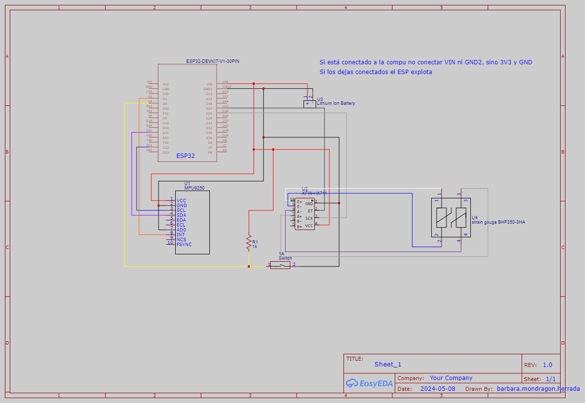

# INIAT_Salud
Sistema de entrenamiento para uso de prótesis transhumeral
 ## Hardware
 - Asegúrate de que todo está conectado de acuerdo al esquema en el brazalete.

 ## Conexión Bluetooth
 - Si tienes un problema al ejecutar el programa de Unity, en primer lugar verifica que el bluetooth de la computadora está encendido.
 - Si los problemas siguen, asegúrate de estar recibiendo los datos de forma correcta, lo puedes hacer con putty, abriendo en el serial el COM asignado al vínculo de bluetooth con el ESP32.
 - Puedes verificar el COM asignado a la conexión de bluetooth en "Administrador de dispositivos", si te aparecen varios puedes ir probando en cuál obtienes los datos.
 - En ocasiones si no funciona la conexión, lo único que tienes que hacer es desconectar y volver a conectar el ESP32 a la fuete de voltaje que estés usando.

 ## Avatares
 - En caso de que quieras crear más avatares, te recomiendo usar https://readyplayer.me/es/avatar en conjunto con https://www.mixamo.com/#/
 - Readyplayer te ayudará a crear el avatar y Mixamo a darle la posición inicial necesaria, que encuentran como T-Pose
 - A partir de esto tienes que darle el rig al personaje y es muy fácil hacerlo siguiendo este tutorial https://www.youtube.com/watch?v=v47lmqfrQ9s&t=871s
 - Si tienes cualquier pregunta o te atoras en algún paso, mándame mensaje

 ## Cosas importantes extras
 - Si la computadora no te está aceptando la contraseña para ingresar, asegurate de estar conectada a una red de la ibero normal, no la que crearon para los oculus
 - Cerrar y abrir el gancho es en sí un proceso complicado, no te frustres si no te sale, por eso se está creando un entrenador y además te ayuda a empatizar con el paciente

   
